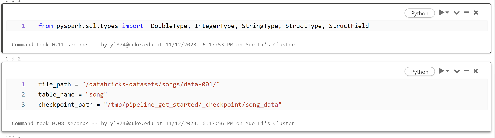
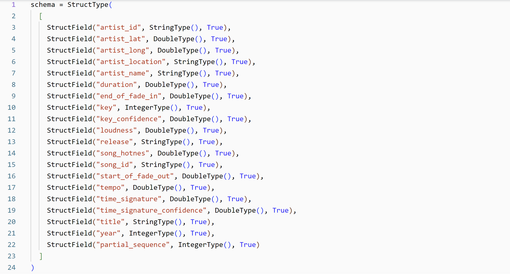
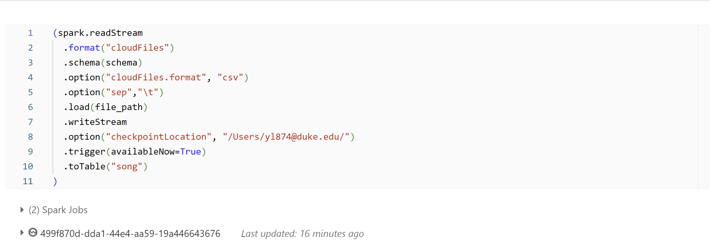
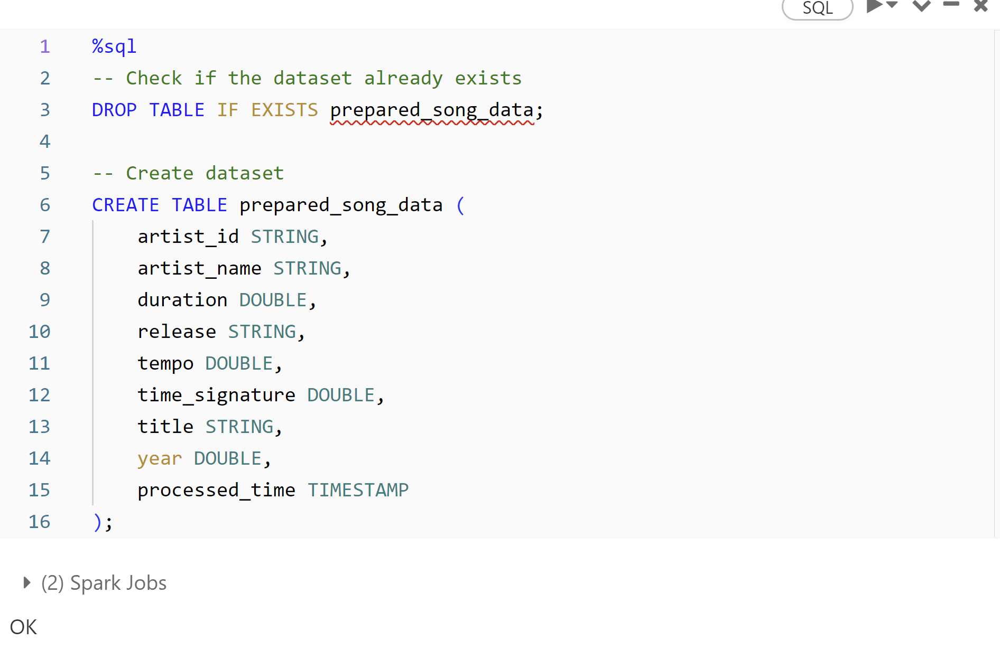
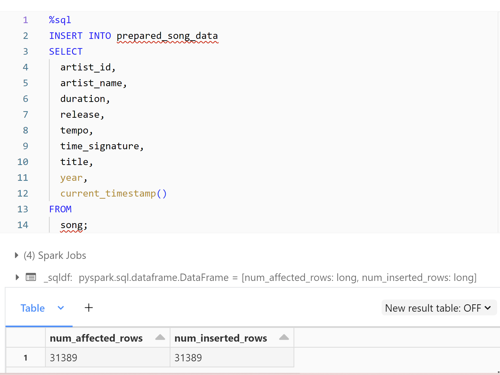
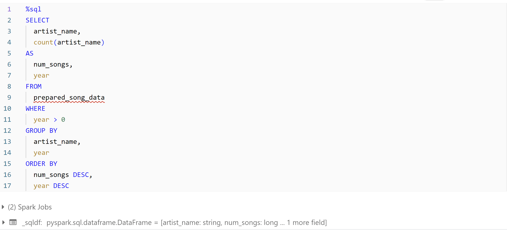
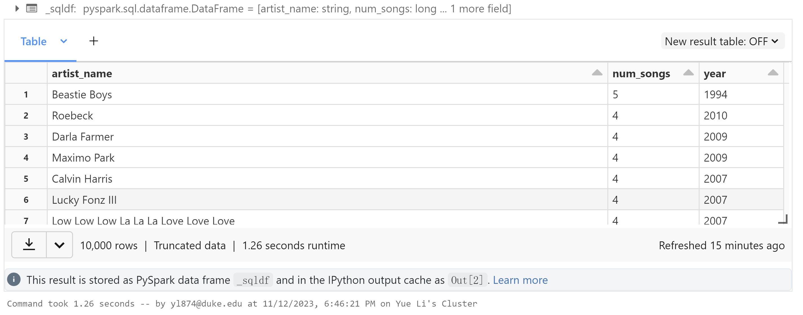
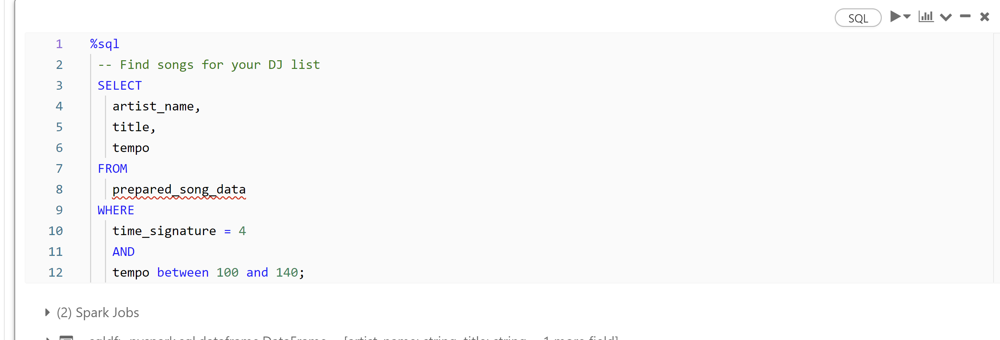
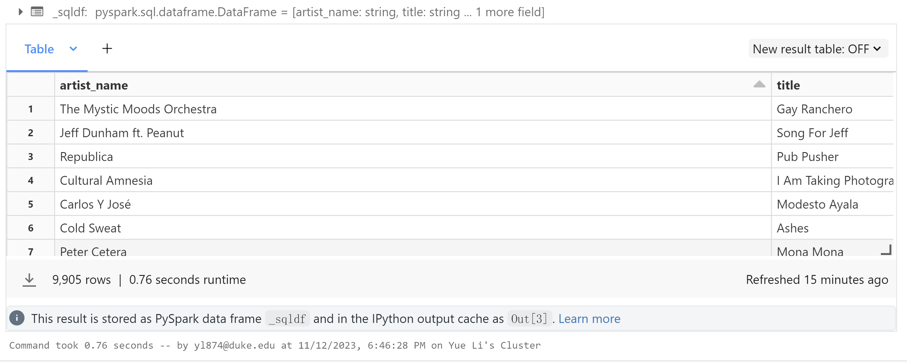
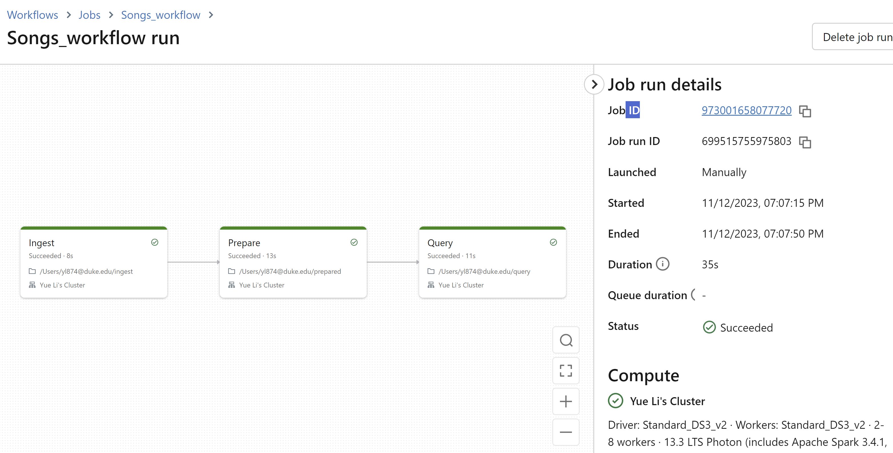

# 706_Week11_YL

This repository includes the main tasks for Week 11:

* `Makefile` is a configuration file used in Unix-based systems for automating tasks and building software. It contains instructions and dependencies for compiling code, running tests, and other development tasks.
* `.devcontainer` includes a Dockerfile and `devcontainer.json`. The `Dockerfile` within this folder specifies how the container should be built, and other settings in this directory may control development environment configurations.
* `Workflows` includes GitHub Actions, which contain configuration files for setting up automated build, test, and deployment pipelines for your project.
* `.gitignore` is used to specify which files or directories should be excluded from version control when using Git.
* `README.md` is the instruction file for the readers.
* `main.py` is a Python file that contains the main function.
* `test_main.py`  is a test file for `main.py` that can successfully run in IDEs.
* `requirements.txt` is to specify the dependencies (libraries and packages) required to run the project.

## Project description
* Create a data pipeline using Databricks
* Include at least one data source and data sink

## Project environment

* Use Databricks for scripting
* Container built in `devcontainers` and virtual environment activated via `requirements.txt`

## ETL Procedure

* Ingest

* Prepare

* Query (The notebook for `query.ipynb` is too large to import to codespace. So I just showcase the screenshots of my SQL query results.)

* Run the whole workflow 

## Databricks cluster
https://adb-7032072092481436.16.azuredatabricks.net/browse?o=7032072092481436

## References
https://docs.databricks.com/en/getting-started/data-pipeline-get-started.html